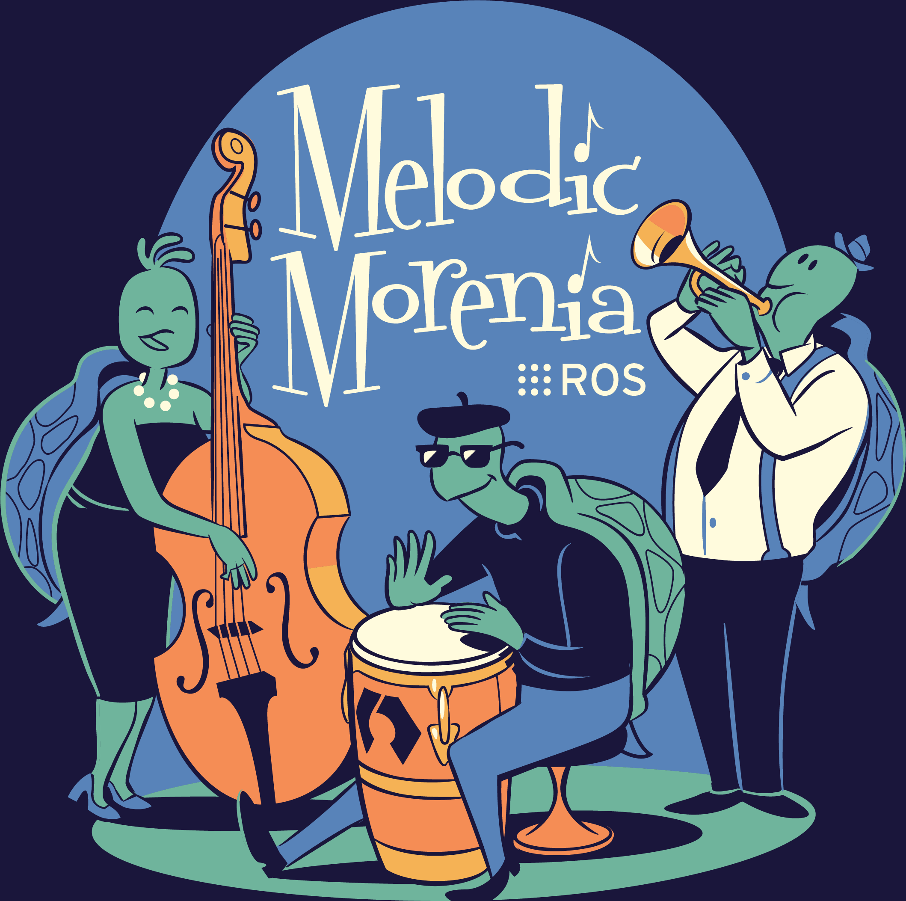

# 1.2 ROS发展历程

## 1.2.1 ROS起源与发展

  本世纪开始，关于人工智能的研究进入了大发展阶段，包括全方位的具体的AI,例如斯坦福大学人工智能实验室STAIR（Stanford Artificial Intelligence Robot）项目，该项目组创建了灵活的、动态的软件系统的原型，用于机器人技术。在2007年，机器人公司Willow Garage和该项目组合作，他们十分具有前瞻性的，提供了大量资源进一步扩展了这些概念，经过具体的研究测试实现之后，无数的研究人员将他们的专业性研究贡献到ROS核心概念和其基础软件包，这期间积累了众多的科学研究成果。ROS软件的开发自始至终采用开放的BSD协议，在机器人技术研究领域逐渐成为一个被广泛使用的平台。

  Willow Garage公司和斯坦福大学人工智能实验室合作以后，在2009年初推出了ROS0.4，这是一个测试版的ROS，现在所用的系统框架在这个版本中已经具有了初步的雏形。之后的版本才正式开启了ROS的发展成熟之路。

## 1.2.2 历代ROS版本

ROS1.0版本发布于2010年，基于PR2机器人开发了一系列机器人相关的基础软件包。随后ROS版本迭代频繁，目前已经发布到了Lunar。 目前使用人数最多的是Kinetic和Indigo这两个Long Term Support版本。

  |    ROS版本    |        发布时间     |
  | :------:    | :------:           |
  | Melodic Morenia  | 2018.5 |
  | Lunar Loggerhead     |   2017.5 |
  | Kinetic Kame     |   2016.5 |
  | Jade Turtle     |   2015.5 |
  | Indigo lgloo     |   2014.7 |
  | Hydro Medusa    |   2013.9 |
  | Groovy Galapagos     |   2012.12 |
  | Fuerte Turtle     |   2012.4 |
  | Electric Emys     |   2011.8 |
  | Diamondback    |  2011.3  |
  | C Turtle       |  2010.8 |
  | Box TurtleBox Turtle    | 2010.3 |

## 1.2.3 展望
ROS的发展逐渐的趋于成熟，近年来也逐步是面对着Ubuntu的更新而更新，这说明ROS已经初步进入一种稳定的发展状态，每年进行一次更新的频率同时还保留着长期支持的版本，这使得ROS在稳步的前进发展同时，也有着开拓创新的方向。目前越来越多的机器人、无人机甚至无人车都开始采用ROS作为开发平台，尽管ROS在实用方面目前还存在一些限制，但前途非常光明。

2018年ROS2 1.0版将发布，未来ROS2将如何影响机器人领域，我们拭目以待。相信在人工智能的大发展、人机交互越来越密切、互联网+的大时代，ROS会发挥出越来越重要的作用。
